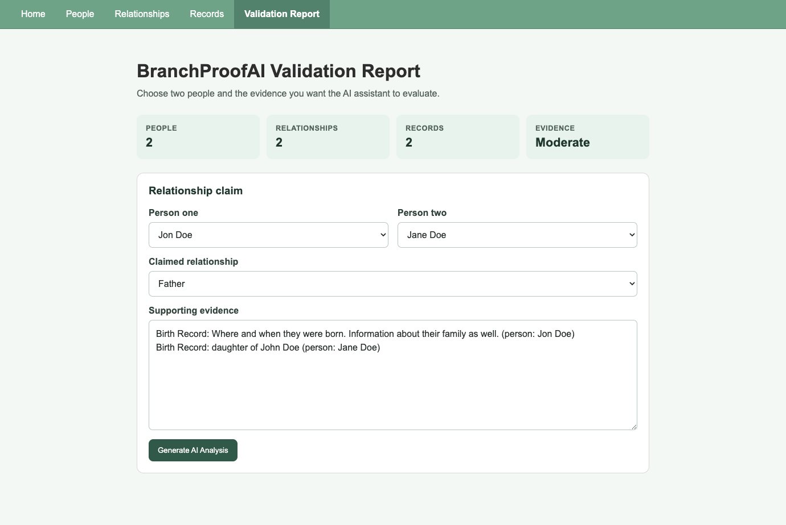
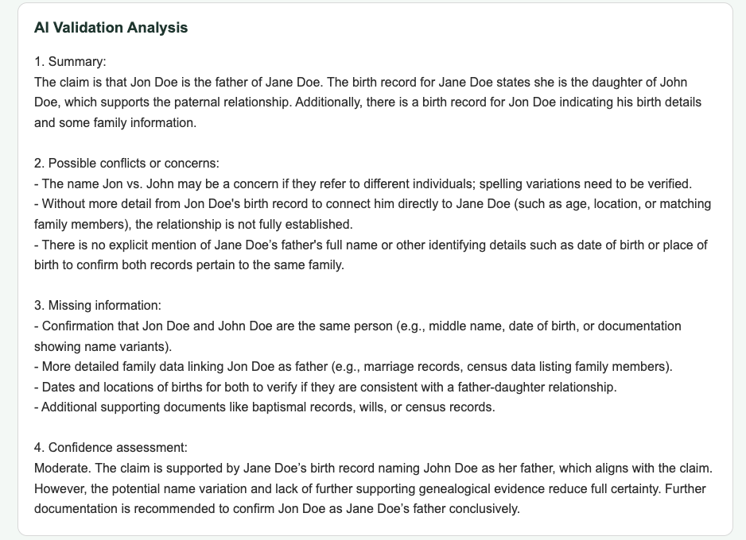

# Branch Proof AI

Branch Proof AI is a full-stack genealogy application for organizing family-history evidence and evaluating claimed relationships between people. It combines structured genealogy data with an AI-assisted validation workflow so researchers can review evidence, identify possible conflicts, and see recommended next steps.

## Current status

**Active, tested full-stack prototype preparing for deployment.**

The Angular client and Express API are connected. The application supports MongoDB-backed management of people, relationships, and records, plus AI-assisted relationship analysis. If the OpenAI service is unavailable, the validation endpoint returns a clearly labeled demo fallback so the workflow remains usable without presenting sample content as a live result.

Branch Proof AI is a decision-support tool. AI reports should be reviewed by a person and verified against original genealogical sources.

## Application preview

### Evidence-based relationship workflow

Users select two saved people, choose the claimed relationship, and review or edit the historical-record evidence before requesting analysis.



### Explainable AI validation

The analysis summarizes the claim, identifies conflicts, lists missing information, and provides a confidence assessment. In this example, it correctly flags the `Jon Doe` versus `John Doe` name discrepancy instead of treating the records as an unquestioned match.



## Features

- Create, view, update, and delete people
- Manage relationships between people
- Add and manage supporting historical records
- Submit relationship evidence for AI-assisted analysis
- Review a summary, potential concerns, missing information, and confidence assessment
- Continue with a visibly labeled fallback report if the AI service is unavailable
- Explore and test the REST API through Swagger UI
- Seed MongoDB with sample genealogy data

## Technology

| Layer | Tools |
| --- | --- |
| Frontend | Angular 21, TypeScript, HTML, CSS, RxJS |
| Backend | Node.js, Express 5 |
| Database | MongoDB, Mongoose |
| AI workflow | OpenAI API with a server-side demo fallback |
| API documentation | Swagger / OpenAPI |
| Testing | Angular test runner, Vitest |

## Architecture

```text
Angular client
    │
    ├── People, relationships, and records services
    └── Validation service
             │
             ▼
Express REST API ──────► OpenAI API
    │                       │
    │                       └── Labeled fallback on failure
    ▼
MongoDB / Mongoose
```

The repository contains the application inside the nested `branch-proof-ai` directory:

```text
branch-proof-ai/
├── branch-proof-ai/
│   ├── server/
│   │   ├── models/
│   │   ├── routes/
│   │   ├── seed.js
│   │   └── server.js
│   ├── src/app/
│   │   ├── components/
│   │   └── services/
│   ├── angular.json
│   └── package.json
└── README.md
```

## Run locally

### Prerequisites

- Node.js 22 or another version supported by Angular 21
- npm
- MongoDB running locally or a MongoDB connection string
- An OpenAI API key for live AI-generated analysis

### Setup

1. Clone the repository and enter the application directory:

   ```bash
   git clone https://github.com/kelsiegarcia/branch-proof-ai.git
   cd branch-proof-ai/branch-proof-ai
   ```

2. Install the locked dependencies:

   ```bash
   npm ci
   ```

3. Create your private environment file:

   ```bash
   cp .env.example .env
   ```

4. Add the appropriate local values to `.env`. Never commit this file.

   ```env
   OPENAI_API_KEY=your_openai_api_key
   MONGODB_URI=mongodb://127.0.0.1:27017/branch-proof-ai
   CLIENT_ORIGINS=http://localhost:4200
   PORT=3000
   ```

5. Optionally load the sample dataset:

   ```bash
   node server/seed.js
   ```

6. Start the Angular client and Express server together:

   ```bash
   npm run dev
   ```

## Local URLs

| Service | URL |
| --- | --- |
| Angular application | `http://localhost:4200` |
| Express API health check | `http://localhost:3000` |
| Swagger API documentation | `http://localhost:3000/api-docs` |

## API overview

| Route | Purpose |
| --- | --- |
| `/api/people` | Manage people |
| `/api/relationships` | Manage relationships |
| `/api/records` | Manage historical records |
| `POST /api/validation/analyze` | Analyze a claimed relationship and its evidence |

Example validation request:

```json
{
  "personOne": "John Smith",
  "personTwo": "Mary Smith",
  "relationship": "Parent-Child",
  "evidence": "Birth certificate and census records"
}
```

## Verification

```bash
npm run build
npm test -- --watch=false
npm audit --omit=dev
```

## Available commands

| Command | Purpose |
| --- | --- |
| `npm start` | Start the Angular development server |
| `npm run server` | Start the Express API with Nodemon |
| `npm run server:start` | Start the Express API with Node.js |
| `npm run dev` | Run the Angular client and Express API together |
| `npm run build` | Create a production Angular build |
| `npm test` | Run the Angular unit tests |

## Deployment roadmap

- Add backend route and database integration tests
- Add authentication and user-specific family trees
- Store validation reports for later review and comparison
- Improve source citation and evidence scoring
- Deploy the client, API, and managed MongoDB database
- Add live-demo screenshots and the hosted URL to this README

## Author

Built by [Kelsie Garcia](https://github.com/kelsiegarcia).
